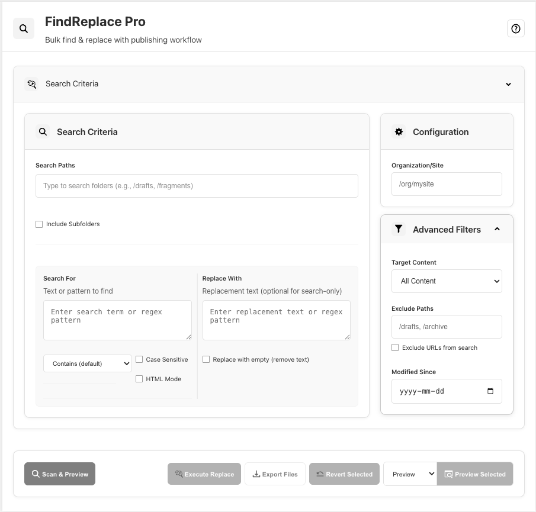

# FindReplace Pro

Bulk find & replace tool with publishing workflow for DA (Document Authoring) platform.

## What It Does

FindReplace Pro helps you search for content across your site, replace it in bulk, and publish the changes. You can search for text or find pages containing specific elements.

## Features

### **Search & Discovery**
- **Content Search** - Find text in all content, page metadata, section metadata, or block content
- **Element Discovery** - Find pages containing specific CSS selectors (leave search term empty)
- **Advanced Search Types** - Contains, Exact Match, Regular Expression with regex groups ($1, $2)
- **HTML Mode** - Search and replace entire HTML blocks with normalized formatting
- **Case Sensitive Search** - Optional case-sensitive matching
- **Multi-Path Search** - Select multiple directories with tag-based path input
- **URL Filtering** - Exclude URLs and attributes from search content
 - **JSON Discovery** - Find JSON files (strict parse-based detection)
 - **JSON Search (Search-only)** - Search within JSON text using Contains/Exact/Regex with case sensitivity

### **Content Management**
- **Bulk Replace** - Select multiple files and replace content
- **Granular Selection** - Select individual matches within files
- **Replace with Empty** - Remove content by replacing with empty string (HTML-compliant)
- **Automatic Versioning** - Creates backup versions before any destructive operations (required for replacement)
- **Version Revert** - Revert selected files to their most recent saved versions
- **Publishing Workflow** - Preview, publish, or unpublish selected files with progress tracking
- **Export Results** - Download selected files with match results

### **User Experience**
- **Smart Filtering** - Filter results by file path or content
- **Pagination** - Results pagination (configurable page size: 10 items/page)
- **Result Accordion** - Collapse/expand individual result matches with global controls
- **Auto-Collapse** - Configuration panel collapses after scan for better workflow
- **Dynamic Button Text** - Action buttons show operation type and selected count
- **Progress Tracking** - Visual feedback during long-running operations

### **Configuration & Filters**
- **Multi-Path Input** - Tag-based system for selecting multiple search paths
- **File Filters** - Exclude paths and filter by modification date
- **Advanced Filters** - Collapsible section with target content and filtering options
- **Auto-Configuration** - Manual org/site input with session caching
- **Include Subfolders** - Optional recursive directory search

## How to Use

### 1. Configure
1. **Org/Site**: Auto-detects from DA context or enter `/org/site` format
2. **Base Path**: Optional - limit search to specific folder
3. **File Filters**: Expand to exclude paths or filter by modification date

### 2. Search
1. **Search For**: Enter text to find (or leave empty for element discovery)
2. **Search Type**: Contains, Exact Match, or Regular Expression
3. **Options**: Enable case-sensitive search or HTML Mode
4. **Target Content**: Choose All Content, Page Metadata, Block Content, or Custom Selector
5. **Advanced Filters**: Exclude URLs, set paths to exclude, or filter by modification date
 
### 2a. JSON Search (Search-only)
1. Open **Advanced Filters** and enable **Find JSON files**
2. Enter a **Search For** term to find text inside JSON (supports Contains/Exact/Regex)
3. Click **Scan & Preview**
4. Review results (replace is disabled in JSON mode)
5. Clicking a JSON result opens the DA Sheets view for the resource (e.g., `https://da.live/sheet#/org/site/path`)

### 3. Scan & Filter
1. Click **"Scan Files"** to search your site
2. Use **filter box** to narrow results by path or content
3. Use **accordion toggles** to expand/collapse individual file matches
4. Navigate with **pagination** if many results

### 4. Select & Execute
**For content changes:**
1. Select files using checkboxes (or use Select All/Clear Selection)
2. Enter **replacement text** (use $1, $2 for regex groups)
3. Click **"Execute Replace"**

**For publishing:**
1. Select files to publish
2. Choose operation: **Preview/Publish/Unpublish**
3. Click operation button (shows count: "Publish Selected (3)")
4. Monitor progress and results

**For reverting changes:**
1. Select files to revert
2. Click **"Revert Selected"** (shows count: "Revert Selected (2)")
3. Confirm restoration to most recent saved versions
4. Monitor progress - automatic backup created before revert

## Examples

### Find all pages with hero blocks
- **Target Content**: Custom Selector
- **Custom CSS Selector**: `.hero`
- **Search For**: (leave empty)

### Remove "- CME Group" from titles
- **Target Content**: Page Metadata Only
- **Search Type**: Contains
- **Search For**: `- CME Group`
- **Replace With**: (empty to remove)

### Regex: Reformat phone numbers
- **Search Type**: Regular Expression
- **Search For**: `(\d{3})-(\d{3})-(\d{4})`
- **Replace With**: `($1) $2-$3`
- **Result**: `312-555-1234` → `(312) 555-1234`

### Regex: Swap name format
- **Search Type**: Regular Expression
- **Search For**: `([A-Z][a-z]+), ([A-Z][a-z]+)`
- **Replace With**: `$2 $1`
- **Result**: `Smith, John` → `John Smith`

### HTML Mode: Replace entire HTML blocks
- **HTML Mode**: Enable checkbox
- **Search For**: `
<h1>Old Title</h1>
`
- **Replace With**: `
<h2>New Title</h2>
`
- **Result**: Complete HTML block replacement

### JSON: Find a property value
- **Advanced Filters**: Enable **Find JSON files**
- **Search Type**: Regular Expression
- **Search For**: `"status":\\s*"draft"`
- **Result**: Lists JSON files containing the property; edit in DA Sheets if needed

### Filter and bulk publish
1. Search for content
2. Filter results: type `/blog` to show only blog pages
3. Select All → Publish Selected (15)

## File Organization

- `search.html` - Main app interface
- `search/search.css` - Styles
- `search/search.js` - App logic
- `search/README.md` - This documentation

## Technical Notes

- **Authentication**: Uses DA SDK for secure access to DA Source and List APIs
- **Publishing**: Integrates with AEM Admin API (admin.hlx.page) for preview/publish/unpublish
- **Versioning**: Automatic backup creation via DA Version Source API (`/versionsource/`) before destructive operations
- **Version Restore**: Uses DA Version List API (`/versionlist/`) to find most recent versions and restore content
- **File Types**: Supports HTML files and JSON (JSON is search-only)
- **HTML Mode**: Raw content processing - no formatting manipulation, preserves exact DA source
- **JSON Handling**:
  - Strict detection: attempts to parse after minimal normalization
  - Search operates on raw JSON text; replace is disabled in JSON mode
  - JSON results open in DA Sheets (e.g., `https://da.live/sheet#/cmegroup/www/metadata`)
- **Content Filtering**: Optional URL filtering (href, src, srcset, data-*, etc.) with exclude checkbox
- **Multi-Path Support**: Tag-based input system with autocomplete and path validation
- **Branch Logic**: Uses 'main' branch for publish/unpublish, current branch for preview
- **Performance**: File caching, pagination (10 results/page), parallel processing, lazy loading
- **Configuration**: Manual org/site input with session caching via CONFIG object
- **UI Architecture**: Accordion-based layout with auto-collapse, dark/light theme support
- **Memory**: Session-based caching for org/site, search settings, and file content
- **Safety Features**: Pre-replacement version creation (required), granular match selection, user confirmations, fail-safe skipping, version restore with automatic backup
- **Icons**: SVG-based icon system with theme-aware filtering